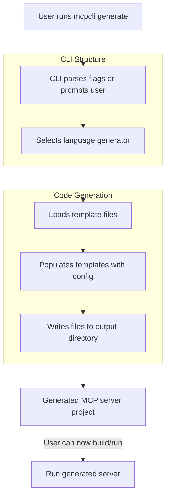

# Project Generation Flow Diagram

```mermaid
flowchart TD
    A[User runs mcpcli generate] --> B[CLI parses flags or prompts user]
    B --> C[Selects language generator]
    C --> D[Loads template files]
    D --> E[Populates templates with config]
    E --> F[Writes files to output directory]
    F --> G[Generated MCP server project]
    
    subgraph CLI Structure
      B
      C
    end
    subgraph Code Generation
      D
      E
      F
    end
    G -.->|User can now build/run| H[Run generated server]
``` 
